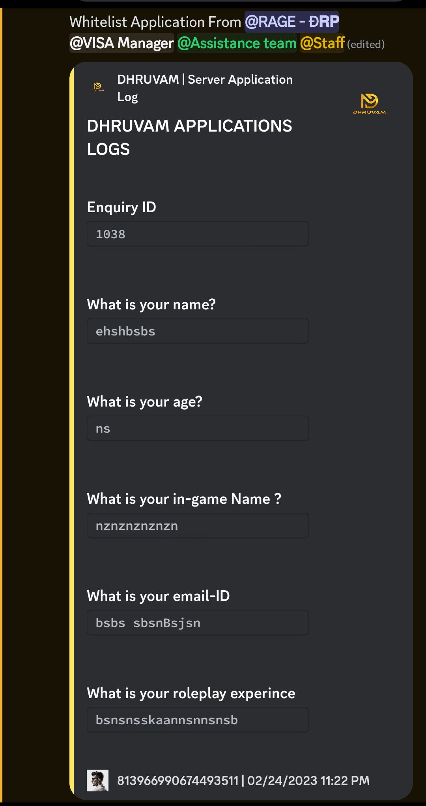

# Discord-Form-Bot

This is a discord form bot the server members can fill the form and can submit to the admins

You can edit the following channel id in config.js

You need to import your discord bot token to the config

After getting to the admin, admins can react from their for example they can accept or reject from their and the reaction will go to the mentioned channel and to the user DM

Some previews:

To start the app use:
    node start.js

To view the list of running processes:
    pm2 list

To restart your application:
    pm2 restart my-app

To stop your application:
    pm2 stop my-app

To monitor logs:
    pm2 logs my-app

