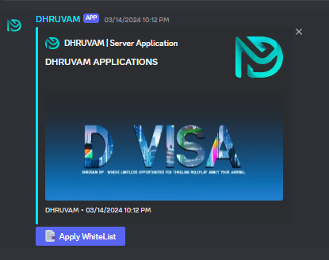

# Discord Form Bot

This is a Discord form bot that allows server members to fill out forms and submit them to the admins. Admins can then react to the submissions, either accepting or rejecting the requests. The reactions will be sent to a specified channel and the user's DM.

## Getting Started

### Prerequisites

- Node.js
- PM2 (Process Manager)

### Installation

1. **Clone the repository**: Clone the repository to your local machine and navigate to the repository directory.

2. **Rename the example environment file**: Rename `example.env` to `.env`.

3. **Add your Discord bot token and other necessary items to the `.env` file**:
    ```
    TOKEN = your_discord_bot_token
    ClientID = your_admin_channel_id
    GuildID =your_guild_id
    ```

4. **Install the dependencies**: Run `npm install` to install the necessary dependencies.

### Starting the Bot

To start the bot, run the following command:
```bash
node start.js
```
## Managing the Bot with PM2
- View the list of running processes:
     ```bash 
    pm2 list
    ```

- Restart your application:
    ```bash
    pm2 restart bot
    ```

- Stop your application:
    ```bash
    pm2 stop bot
    ```

- Monitor logs:
    ```bash
    pm2 logs bot
    ```

## Initial Setup

Use the /setup command for the initial setup.

## Usage
Once the bot is running, server members can fill out forms and submit them to the admins. Admins can then react to the submissions from their end. Accepted or rejected requests will be communicated to the mentioned channel and the user's DM.

## Commands

- **/setup**: Initializes the bot setup.
- **/acceptwl [user]**: Admin command to accept a form submission.

## Screenshots




## Troubleshooting

- **Bot not starting:**
    - Ensure you have renamed `.env.env` to `.env`.
    - Check if the Discord bot token is correctly added in the `.env` file.
    - Ensure all dependencies are installed by running `npm install`.

- **Commands not working:**
    - Check if the bot has the necessary permissions.
    - Ensure the bot is running and connected to the correct server.

- **Support**

    If you have any questions or need help, feel free to contact me on Discord: [Join Now](https://discord.gg/bDaYd2P9Vu).

## License

This project is licensed under the LGPL License. See the [LICENCE](https://github.com/Rage-Gaming/Discord-Form-Bot/blob/main/LICENCE.md). file for details.
